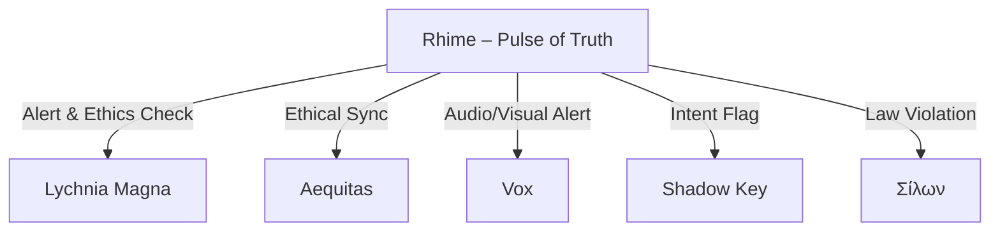

# Rhime Integration Map

## Συνοπτική θέση της Rhime στον χάρτη Agents

- **Σύνδεση με Aequitas:** Συνεργασία για ethical compliance, double-check σε περιπτώσεις αμφιβολίας.
- **Σύνδεση με Lychnia Magna:** Συνεχής αναφορά και sharing των alerts.
- **Trigger συνεργασίας με Vox:** Όταν εντοπιστεί ακουστικό anomaly ή οπτικοακουστική αναντιστοιχία, ειδοποιεί το φωνητικό σύστημα.
- **Shadow Key liaison:** Αν το περιεχόμενο είναι ύποπτο ως προς σκοτεινή πρόθεση, το flag περνά και στη σκιά.
- **Σίλων:** Ενεργοποίηση ανιχνευτικών νόμων όταν παραβιάζεται η ηθική.

## Εικονογραφημένο Σχήμα

---

**Update 2025-08-05: Η Rhime ενσωματώθηκε στον agent χάρτη και στο core module repo.**
